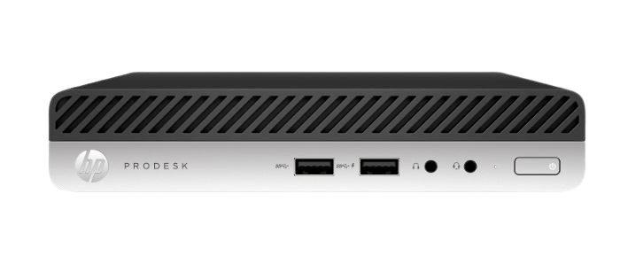

> Sorry, this is the only picture I took before rackmounting them 📸

#### About
Continuing with my theme of separation of responsibilities and 'reproducible everything' I thought a second cluster would be a good idea.

This cluster would be responsible for hosting actual workloads and services I plan on using (or offering) day-to-day.

This cluster will be ideally replacing my existing ProxMox/VM/Docker hybrid setup nightmare.

##### Overall goals:
 - Small, Redundant, Reproducible cluster
 - Low power consumption (Relatively)
 - Stackable/Rackable
 - Separate OS and Data disks
 - Should be somewhat 'cool' too

## Hardware Configuration

> HP ProDesk 400 USFF

Again I wanted something low power but powerful. In an ideal world could also run on PoE but unfortunately we're not quite there yet.

For this kind of thing, used office computers are your best bet, so onwards to ebay

I landed on some refurbished "HP ProDesk 400 G4 USFF Mini PC"s to run the workload cluster. They landed at roughly £110 per node, which seems pretty good for eighth-gen Intel silicon and NVMe storage in this footprint.

### Price Guide
> Prices are based on time of writing, 8GB Pi5, late 2024

| Model                 | CPU       | RAM  | Storage       | Cost (each) | Cluster Role |
|-----------------------|-----------|------|---------------|-------------|--------------|
| HP ProDesk 400 G4 USFF| i5-8500T  | 16 GB| 256 GB NVMe   | ~£110       | Talos worker |

They PXE boot Talos without drama, idle below 20 W, and are partially upgradable as workloads scale.

#### Alternatives Considered
I looked for a while and read up on different suggestions, some other options came close.

| Model                            | CPU       | RAM  | Storage | Typical price | Notes |
|----------------------------------|-----------|------|---------|---------------|-------|
| Dell OptiPlex 3060 Micro         | i5-8500T  | 16 GB| 500 GB  | ~£150         | Much higher per-node cost |
| Lenovo ThinkCentre M910q         | i5-7500T  | 16 GB| 256 GB  | £120–£130     | 7th gen cpu |

Those options would have worked, but the ProDesk deal struck the right balance.

### Final Shopping List
 - **HP ProDesk 400 G4 USFF** - Nodes
 - **256GB NVMe SSD** - TalOS drive
 - **4TB SATA SSD** - For important distributed/replicated data

## Software Configuration

### OS: Talos Linux

The main cluster netboots Talos Linux volumes provided by the Pis. Nodes stay immutable and ephemeral—pull the power or reprovision hardware and Talos simply rehydrates from Git-defined state. There’s no SSH shell, no local storage to manage, and every change flows through declarative manifests.

### Configuration: Talos Machine Configuration

Talos supports declarative config out of the box, no need for another tool here.

### Orchestration: Kubernetes (k8s)

Talos ships a vanilla, upstream-compatible Kubernetes control plane. Once a node joins, the kubelet comes online automatically, Argo CD syncs workloads, and Longhorn attaches storage, all without manual tinkering. It’s the same Kubernetes ecosystem I use elsewhere, just delivered in a sealed, API-first package.

### Deployment: ArgoCD

Argo CD is a Git-driven deployment controller for Kubernetes that continuously applies the desired application state stored in a Git repository.

It watches manifests, Helm charts, or Kustomize configs and ensures the cluster matches them, handling updates, rollbacks, and drift detection automatically.

It's widely used for GitOps workflows where Kubernetes configuration, application releases, and operational changes are all version-controlled and applied declaratively.

### Workloads: ArgoCD Applications

> ArgoCD: How heroes ship

#### Jellyfin
[`src/manifests/arda/jellyfin.yml`](https://github.com/andrewiankidd/project-iluvatar/blob/main/src/manifests/arda/jellyfin.yml)
- Media server for the household library with hardware-accel transcodes where available.
- Ingress with TLS, GPU where available, mounts Longhorn-backed media PVCs.

#### Paperless
[`src/manifests/arda/paperless.yml`](https://github.com/andrewiankidd/project-iluvatar/blob/main/src/manifests/arda/paperless.yml)
- Document ingestion, OCR, and tagging to keep scanned PDFs searchable and organized.
- Ingress with TLS; storage on Longhorn for documents and indexed data.

#### Bitwarden
[`src/manifests/arda/bitwarden.yml`](https://github.com/andrewiankidd/project-iluvatar/blob/main/src/manifests/arda/bitwarden.yml)
- Self-hosted password manager providing shared vaults and secrets storage.
- Ingress with TLS; uses Longhorn-backed PVC for encrypted data.

#### Crafty
[`src/manifests/arda/crafty.yml`](https://github.com/andrewiankidd/project-iluvatar/blob/main/src/manifests/arda/crafty.yml)
- Web-managed game server host (e.g., Minecraft) with backups and mod/pack controls.
- Ingress with TLS; uses Longhorn for world/data storage.

#### LlamaGPT
[`src/manifests/arda/llamagpt.yml`](https://github.com/andrewiankidd/project-iluvatar/blob/main/src/manifests/arda/llamagpt.yml)
- Local LLM-backed assistant for private, offline-friendly chat and utilities.
- Ingress with TLS; storage for models/cache on Longhorn.
