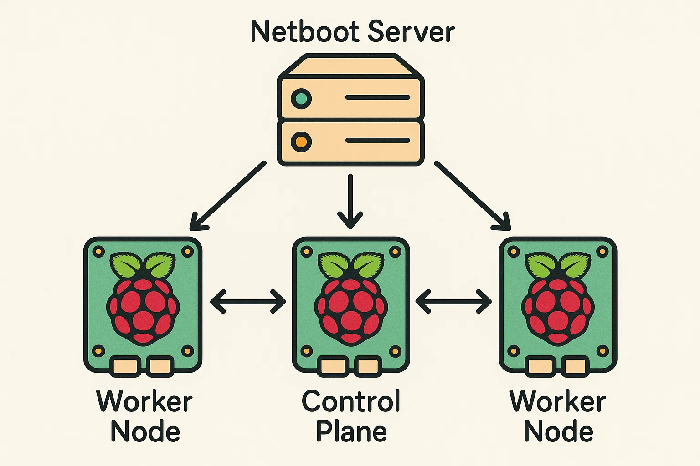

#### About

Build a hand-crafted, immutable Kubernetes OS, where nodes automatically form and join a cluster, running fully in memory.

:::tip[Feeling lost?]
It's probably a good idea to review [Diskless Pi Netboot](./../Netbooting%20Raspberry%20Pi/) before continuing.
:::

## Explanation

Given you have the ability to completely automate the provisioning of machines plugged into your network, what do you do then - how do you have these machines do something other than sitting idle, burning electricity without anything to do?

In this very specific use case, the answer to your problem is **orchestration**, specifically via Kubernetes. Using Kubernetes you can connect your machines into a singular cluster which can pool resources and manage workloads across all connected 'nodes'.

There are of course other ways to solve this problem, via Kubernetes alternatives like Hashicorp Nomad and Docker Swarm, Non-container based cluster tools like Slurm or you could build your own with queues and automation frameworks - but Kubernetes is my preference so it fits well here.

The end result of this will be a completely ephemeral, diskless cluster that makes use of tmpfs for runtime logic, meaning reboots runs from scratch every time.
You define the cluster, you boot the machines, and when they power off, there is no trace.

While this might not sound useful on it's own, consider the ability to reliably reproduce a bare metal cluster from scratch, completely declaratively and without any dependencies on the hardware itself.

## Next Steps

First we'll look at using cloud-init to prove out you can even run Kubernetes without any persisted storage.
