## Explanation

Using the Raspberry Pi netboot process you can boot a pre-configured, ready to use computer with just a network cable and some setup.

:::caution[Security]
TFTP and NFS provide no authentication or encryption. Run this stack only on a trusted LAN/VLAN and restrict access to the server by subnet/firewall.
:::

### What is Netboot?

Raspberry Pi netboot is a firmware-level feature that allows the devices bootloader to boot into an operating system entirely from the network, without using an SD card or local storage. This process is not PXE-based but uses the Pi’s own boot protocol, enabling centralized provisioning, maintenance, and diskless operation across Supporting Multiple Pis.

### How Pi Netboot works

At power-on the Pi's built-in bootloader will immediately attempt to retrieve it's boot files (firmware, bootloader, kernel, config), first by looking at attached storage then by checking the network for any available TFTP (Trivial File Transfer Protocol) servers that might have them.

The TFTP server is found by asking the networks DHCP server (probably your router) for it's address. The common configuration used for this is 'Option 66' or 'TFTP Server Name', defining this setting in your DHCP Server (or router) will let devices on the network know where to look for boot files.

Alternatively, if you don't have access to your networks DHCP configuration, it can instead be defined on a storage device in `boot/config.txt` under `TFTP_IP`, but as mentioned previously this requires an existing boot device, which we don't have.

If the Pi receives a response, and the connection to the server connection succeeds, the Pi bootloader immediately looks for its boot filesystem contents, starting with `/config.txt`.

Initially the root of the server will be queried, but the Pi will also attempt to look under a subdirectory matching the its serial number, which can be utilized to manage device specific boot configurations.

```mermaid
---
title: Pi TFTP Lookup Sequence
---
flowchart TB
    A[Raspberry Pi] -->|TFTP/config.txt<br/>✓ Success| B[Server]
    A -->|TFTP/&lt;serial&gt;/config.txt<br/>✗ 404 Not Found| B
    A -->|TFTP/&lt;other boot files&gt;| B

```

From there the boot files instruct the Pi on what to do next. This will of course depend on what you have set up in `/cmdline.txt`, but the typical move here is to mount the desired OS filesystem from an NFS (Network File System) server and boot into that.

## Implementation
So in order to do this in the most reproducible way possible, we have a few things to put together:
 - DHCP Configuration
 - TFTP, NFS Servers
 - Bootable firmware, bootloader, kernel and configuration files
 - The OS itself and its configuration

Since I want to keep this process fairly self contained and reproducible, I chose to use containers to implement these severs.

The steps in this guide will cover the implementation and configuration in more depth/detail.

