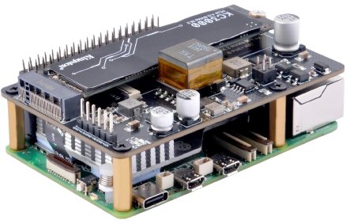

Big ambitions usually come with big price tags, this one’s no different. For the bootstrap layer I ended up with a couple of Raspberry Pi 5's.

In order to get NVMe and PoE support, you have to pick up additional “HATs” (Hardware Attached on Top) that sit on the Pi and connect to its GPIO headers. It’s fiddly, but the end result is still cheaper and quieter than x86 boxes for this role.

#### Node configuration
| Configuration               | Master | Netboot | Cluster Storage  | Cost                   |
|-----------------------------|--------|-------|------------------|------------------------|
| Pi + SD + NVMe + PoE        |  ✅   |  ❌   |  ✅              | £80+£5+£15+£22 = £122 |
| Pi + SD + NVMe              |  ✅   |  ❌   |  ✅              | £80+£5+£15 = £100     |
| Pi + SD + PoE               |  ✅   |  ❌   |  ❌              | £80+£5+£22 = £107     |
| Pi + SD                     |  ✅   |  ❌   |  ❌              | £80+£5 = £85          |
| Pi + NVMe + PoE             |  ❌   |  ✅   |  ✅              | £80+£15+£22 = £117    |
| Pi + NVMe                   |  ❌   |  ✅   |  ✅              | £80+£15 = £95         |
| Pi + PoE                    |  ❌   |  ✅   |  ❌              | £80+£22 = £102        |
| Pi                          |  ❌   |  ✅   |  ❌              | £80                   |

:::note[Moan]
These were originally purchased for and subsequently used in a working NixOS implementation of this cluster, but [the community repo I was using was archived](https://github.com/nix-community/raspberry-pi-nix). [TalOS isn't supported at all as of yet](https://github.com/siderolabs/talos/issues/7978).

Given the proprietry nature of the RPi and the headaches caused by this, in future I'd probably opt for a true open source SBC.
:::
