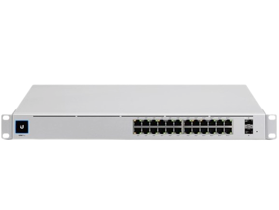

## Other Hardware
These are mostly optional extras

### Network

A Ubiquiti Dream Machine SE acts as my primary router (among other things). It runs the network and provides a single pane of glass for all settings and monitoring.

### Power Management (PoE)

I have a Ubiquiti USW-Pro-24-PoE network switch; which provides 400W of Power-over-Ethernet across 24 Ports.
Using this switch I can remotely control the power to nodes (and other devices) on demand.
